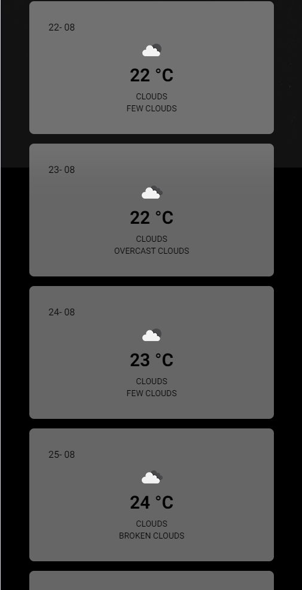

# A SIMPLE JS WEATHER APP

---

This is a simple JS project using Express JS and TailwindCSS.It's a simple Weather App, using OpenWeather API.
Marking down my transition to JS syntax from Python, and serving as a mini "capstone" project to test my knowledge.

---

## APP IMAGES

 

